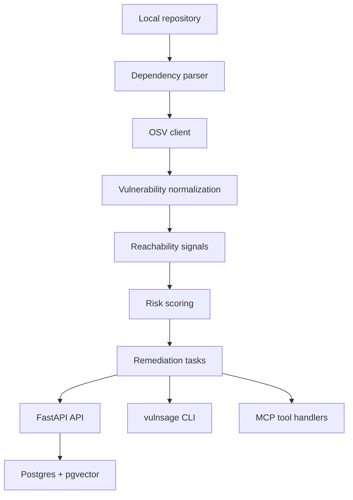

# VulnSage AI

Agentic vulnerability triage and remediation planning for software teams.

VulnSage AI turns dependency and security alerts into prioritized,
evidence-backed remediation tasks. The current milestone is a backend MVP:
FastAPI, Postgres with pgvector, Node dependency parsing, OSV lookup,
normalization, deterministic risk scoring, a scan endpoint, and a CLI.

## Architecture



## Quick Start

```bash
docker compose up -d postgres

cd backend
python -m venv .venv
source .venv/bin/activate
pip install -e ".[dev]"
alembic upgrade head
uvicorn app.main:app --reload
```

Health check:

```bash
curl http://localhost:8000/health
```

From the repository root in another shell, scan the demo repo:

```bash
backend/.venv/bin/vulnsage scan demo-repos/payments-api --workspace-root . --offline --json
```

Write and inspect a deterministic demo report with findings:

```bash
cd backend
.venv/bin/python -m app.eval.generate_demo_report --output /tmp/vulnsage-report.json
.venv/bin/vulnsage validate-report /tmp/vulnsage-report.json
.venv/bin/vulnsage findings /tmp/vulnsage-report.json --limit 5
```

Run the no-key AI MVP demo:

```bash
cd backend
.venv/bin/vulnsage ai-demo --output-dir /tmp/vulnsage-ai-demo
```

This writes:

```text
/tmp/vulnsage-ai-demo/scan-report.json
/tmp/vulnsage-ai-demo/ai-context-bundle.json
/tmp/vulnsage-ai-demo/sample-ai-output.json
/tmp/vulnsage-ai-demo/ai-validation.json
```

Or use the API:

```bash
curl -X POST http://localhost:8000/repos/scan-local \
  -H "Content-Type: application/json" \
  -d '{"path":"demo-repos/payments-api"}'
```

The API constrains local scans to the server-configured
`VULNSAGE_LOCAL_SCAN_WORKSPACE_ROOT`; clients cannot choose the trust boundary
per request.

## Tests

The core service tests avoid network and database dependencies.

```bash
cd backend
.venv/bin/python -m pytest
```

## Current MVP Status

- FastAPI health endpoint
- Postgres and pgvector Docker Compose service
- Alembic initial schema for repos, scans, packages, vulnerabilities,
  remediation tasks, traces, eval tables, and embeddings
- Node package.json and package-lock parser
- OSV API client
- OSV normalization and alias deduplication
- Basic reachability signals from imports and source paths
- Deterministic risk scoring and priority assignment
- Local scan endpoint and CLI command
- Strict public report schema shared by CLI, API, and MCP-facing handlers
- Report validation and compact findings CLI commands
- Safe MCP-ready tool handlers for scan, list findings, evidence, remediation
  context, AI context bundle generation, AI output validation, and report
  validation
- Local MCP stdio server entrypoint for AI clients that support MCP
- Unit tests for parser, OSV client, normalization, risk scoring, and scan flow

Current focus: backend core engine plus client-AI guardrails, with UI
intentionally deferred.

Next milestone: package one-command client setup helpers for Claude Code,
Cursor, and Codex.

This MVP is intentionally CLI/API-first so the security analysis engine stays the priority.

## Local MCP Server

The MCP server lets a local AI client call Sage tools without a Sage-owned model
API key. The AI client supplies the model; Sage supplies deterministic security
tools.

Run the server from this repo:

```bash
cd backend
.venv/bin/python -m app.mcp.stdio_server --workspace-root ..
```

After rerunning `pip install -e ".[dev]"` when scripts change, clients can also
launch:

```bash
.venv/bin/vulnsage-mcp --workspace-root /absolute/path/to/repo
```

Example MCP client config shape:

```json
{
  "mcpServers": {
    "sage-ai": {
      "command": "/absolute/path/to/VulnSageAI/backend/.venv/bin/vulnsage-mcp",
      "args": ["--workspace-root", "/absolute/path/to/repo"]
    }
  }
}
```

Exposed tools:

- `scan_repo` with `repo_path`, optional `offline`, and optional `max_findings`
- `list_findings`
- `get_finding`
- `get_finding_evidence`
- `get_remediation_context`
- `get_ai_context_bundle`
- `validate_ai_output`
- `validate_report`

## AI MVP Flow

The AI MVP does not require a Sage-owned model API key.

```text
Sage scans the repo
→ Sage creates a focused AI context bundle
→ Claude Code, Cursor, or Codex explains the finding
→ Sage validates the AI answer against the evidence IDs
```

Generate a bundle from a report:

```bash
cd backend
.venv/bin/vulnsage ai-context-bundle /tmp/vulnsage-report.json \
  --task-id task_wave1_demo_01 \
  --output /tmp/vulnsage-ai-context.json
```

Validate a client AI response:

```bash
cd backend
.venv/bin/vulnsage validate-ai-output /tmp/vulnsage-report.json \
  /tmp/client-ai-output.json \
  --task-id task_wave1_demo_01 \
  --json
```

The validator fails closed when the AI changes protected fields, cites unknown
evidence, makes fact/inference claims without matching citations, includes
unsupported claims, or emits unsafe exploit-style language.

## Client AI Setup

Use the MCP server when you want the AI client to call Sage tools directly.

Claude Code local stdio setup:

```bash
claude mcp add --transport stdio sage-ai \
  -- /absolute/path/to/VulnSageAI/backend/.venv/bin/vulnsage-mcp \
  --workspace-root /absolute/path/to/repo
claude mcp list
```

Cursor `~/.cursor/mcp.json` example:

```json
{
  "mcpServers": {
    "sage-ai": {
      "type": "stdio",
      "command": "/absolute/path/to/VulnSageAI/backend/.venv/bin/vulnsage-mcp",
      "args": ["--workspace-root", "/absolute/path/to/repo"]
    }
  }
}
```

Codex MCP config shape:

```toml
[mcp_servers.sage-ai]
command = "/absolute/path/to/VulnSageAI/backend/.venv/bin/vulnsage-mcp"
args = ["--workspace-root", "/absolute/path/to/repo"]
```

Ask the client:

```text
Use sage-ai to scan this repo offline, get the top finding's AI context bundle,
write a cited remediation explanation, then validate your AI output with
sage-ai before showing it to me.
```

References checked for setup shape:

- Claude Code MCP docs: https://code.claude.com/docs/en/mcp
- Cursor MCP docs: https://docs.cursor.com/context/model-context-protocol
- OpenAI Docs MCP guide: https://developers.openai.com/learn/docs-mcp

## Security Constraints

VulnSage AI is defensive tooling. It does not generate exploit payloads,
automate exploitation, scan third-party systems without permission, auto-merge
patches, or accept risk without human approval.
