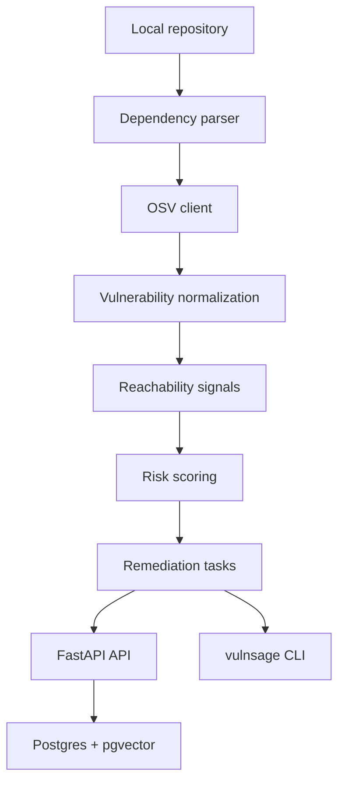

# VulnSage AI

Agentic vulnerability triage and remediation planning for software teams.

VulnSage AI turns dependency and security alerts into prioritized,
evidence-backed remediation tasks. The current milestone is a backend MVP:
FastAPI, Postgres with pgvector, Node dependency parsing, OSV lookup,
normalization, deterministic risk scoring, a scan endpoint, and a CLI.

## Architecture



## Quick Start

```bash
docker compose up -d postgres

cd backend
python -m venv .venv
source .venv/bin/activate
pip install -e ".[dev]"
alembic upgrade head
uvicorn app.main:app --reload
```

Health check:

```bash
curl http://localhost:8000/health
```

Scan the demo repo:

```bash
vulnsage scan ../demo-repos/payments-api --json
```

Or use the API:

```bash
curl -X POST http://localhost:8000/repos/scan-local \
  -H "Content-Type: application/json" \
  -d '{"path":"../demo-repos/payments-api"}'
```

## Tests

The core service tests avoid network and database dependencies.

```bash
cd backend
PYTHONPATH=. python -m unittest discover tests
```

After installing dev dependencies, pytest also works:

```bash
pytest
```

## Current MVP Status

- FastAPI health endpoint
- Postgres and pgvector Docker Compose service
- Alembic initial schema for repos, scans, packages, vulnerabilities,
  remediation tasks, traces, eval tables, and embeddings
- Node package.json and package-lock parser
- OSV API client
- OSV normalization and alias deduplication
- Basic reachability signals from imports and source paths
- Deterministic risk scoring and priority assignment
- Local scan endpoint and CLI command
- Unit tests for parser, OSV client, normalization, risk scoring, and scan flow

Current focus: backend core engine first, with UI intentionally deferred.

## Security Constraints

VulnSage AI is defensive tooling. It does not generate exploit payloads,
automate exploitation, scan third-party systems without permission, auto-merge
patches, or accept risk without human approval.
